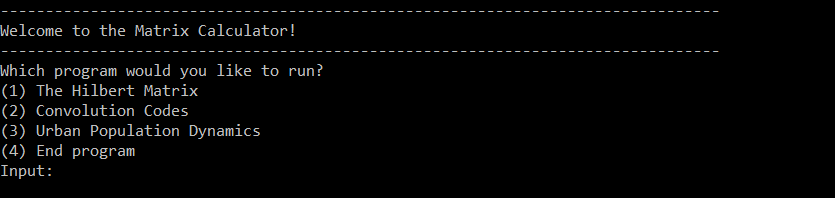
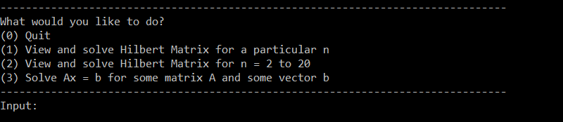
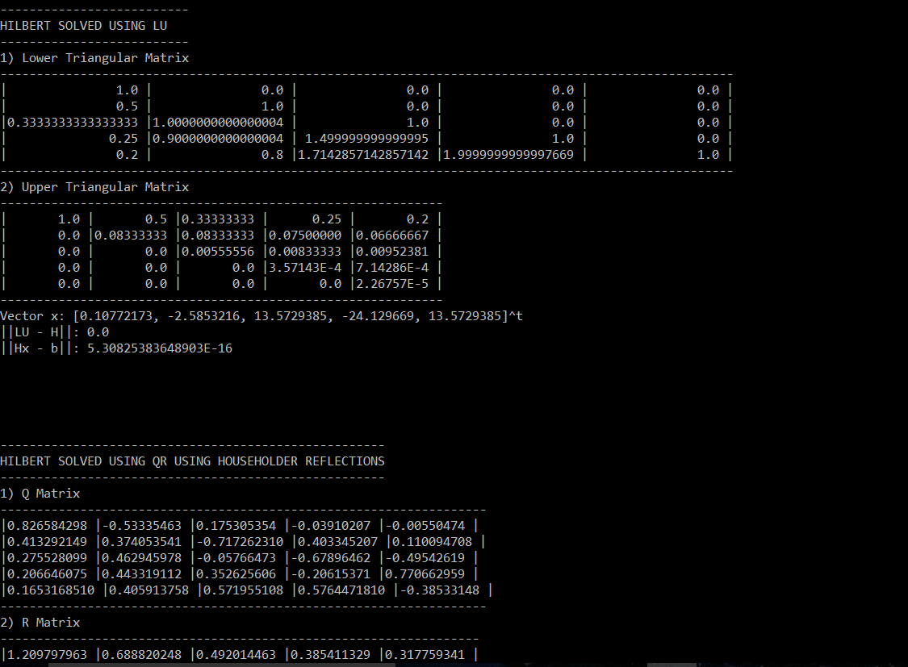
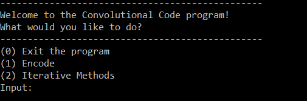
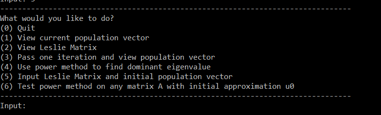

# Matrix-Calculator
A program that applies common functions to matrices and vectors. 
Created by: Siddarth Senthilkumar, Ashika Ganesh, & Katherine Cabezas

## How to Use

1) Open terminal and cd into the directory containing the source files. 
2) Type `javac *.java` and press Enter. 
3) Type `java MCWindow` and press Enter to run the utility.

## Usage Modes
MCWindow provides 4 options. 
 

To run programs that are associated with a certain part of the project, simply enter the number. 
For example, if you want to do computations with power_method, since this was part of Urban Dynamics, type`3` and press enter.

### Hilbert Matrix
Hilbert Matrix has 4 options. 
 

0 - Exits the Hilbert Matrix procedures and returns to the main menu. 
1 - Allows a user to enter an integer n for a Hilbert Matrix of dimensions n x n and then displays the LU/QR-Householder/QR-Givens factorizations, solutions and approximate error. 
2 - Displays all n = 2 to 20 Hilbert matrices, solutions, and errors for all factorizations. 
3 - Allows a user to input a matrix and/or vector, then solves the system using all three factorization methods, prints out the matrices, errors, and solution vectors. 
Note:
#####A user should input the matrix file followed by a space and then the vector file. If the matrix is an augmented matrix, the user simply needs to enter the file name, a space, and 0. For example, "a.dat 0".
 
### Convolution Codes
Convolution Codes has 3 options. 
 

### Urban Population Dynamics
Urban Population Dynamics has 7 options. 
 

0 - Quits the program 
1 - Prints the current population vector (default to the one in the PDF). 
2 - Prints the Leslie matrix used in the program. 
3 - Advances the population one generation and prints the population (before and after the advance). 
4 - Uses the power method to find the dominant eigenvalue. Accepts a tolerance of 0.000000001 by default. The only way to change this tolerance is to manually enter it in (6). 
5 - Allows the user to modify the Leslie matrix and initial population vector. The same rules apply for inputting file names as Hilbert's. Subsequent iterations on the Leslie matrix will be run on these new values so long as the user does not quit the urban population dynamics program, at which the default vector and matrix will be restored. 
6 - Allows the user to test the power method on a Matrix A and initial approximation vector u. The same input rules apply as Hilbert's. The program will then ask for a tolerance level. At this point, the user enters a decimal tolerance for the accuracy of the power method to be computed. If the matrix does not converge, the program will print so.
